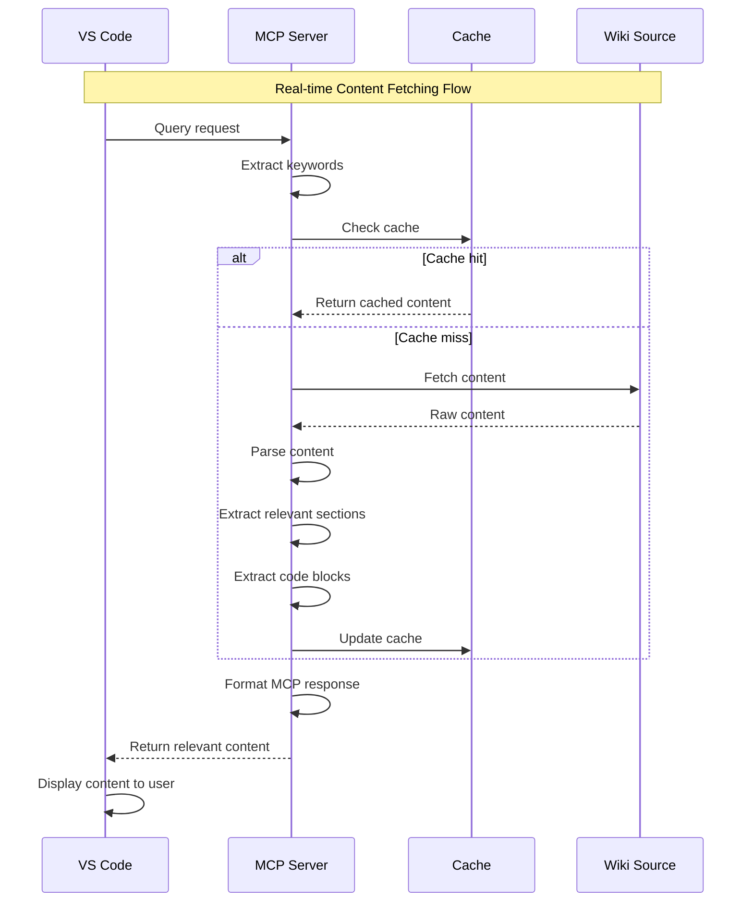

```mermaid
sequenceDiagram
    participant VS Code
    participant MCP Server
    participant Cache
    participant Wiki Source
    
    Note over VS Code,Wiki Source: Real-time Content Fetching Flow
    
    VS Code->>MCP Server: Query request
    MCP Server->>MCP Server: Extract keywords
    MCP Server->>Cache: Check cache
    
    alt Cache hit
        Cache-->>MCP Server: Return cached content
    else Cache miss
        MCP Server->>Wiki Source: Fetch content
        Wiki Source-->>MCP Server: Raw content
        MCP Server->>MCP Server: Parse content
        MCP Server->>MCP Server: Extract relevant sections
        MCP Server->>MCP Server: Extract code blocks
        MCP Server->>Cache: Update cache
    end
    
    MCP Server->>MCP Server: Format MCP response
    MCP Server-->>VS Code: Return relevant content
    VS Code->>VS Code: Display content to user
```
